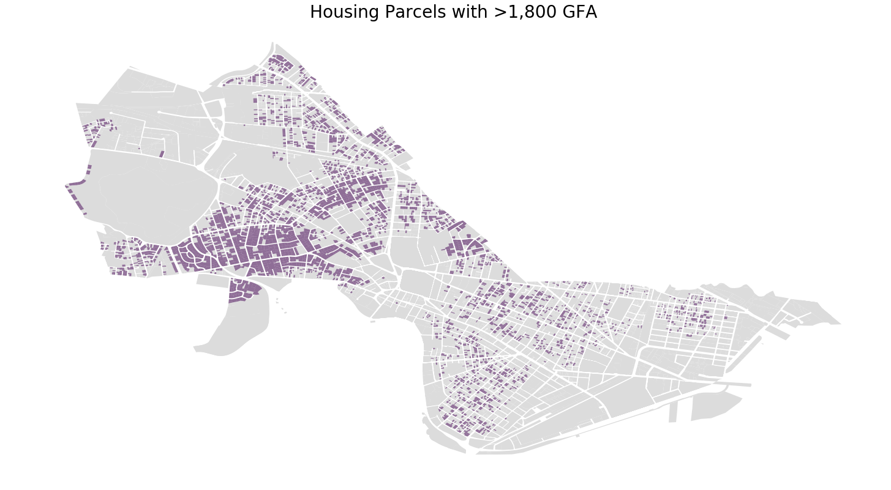

# Cambridge Property Analysis

This analysis looks into the property dataset on Cambridge Open Data portal. The maps created and analysis were used for Harvard Graduate School of Design's Land Use Law Zoning Code Exercise where we are meant to analyze an existing zoning code and propose beneficial changes. My paper is about the eligible lots for ADUs and how criteria can be relaxed to encourage development. 

## Objective: 
The objective for this analysis is to look into lot parcels in Cambridge, MA where accessory dwelling units (ADUs) are possible. Due to changing regulations in the city zoning code, these eligible lots have fluctuated over time, but the main factors are the area of the lot and the interior area of the house/dwelling unit.
Data from [this location](https://data.cambridgema.gov/Assessing/Cambridge-Property-Database-FY16-FY20/eey2-rv59).

## Cambridge Map of Lots Currently Eligible for ADUs:

## Zoning Code:
For those interested, accessory apartment development and use is covered Section 4.22 in the Cambridge Zoning Code. The full amendment is available in the docs folder. Parts of the analysis comes from a memo from Barrett, and that is also included in the docs folder. 
